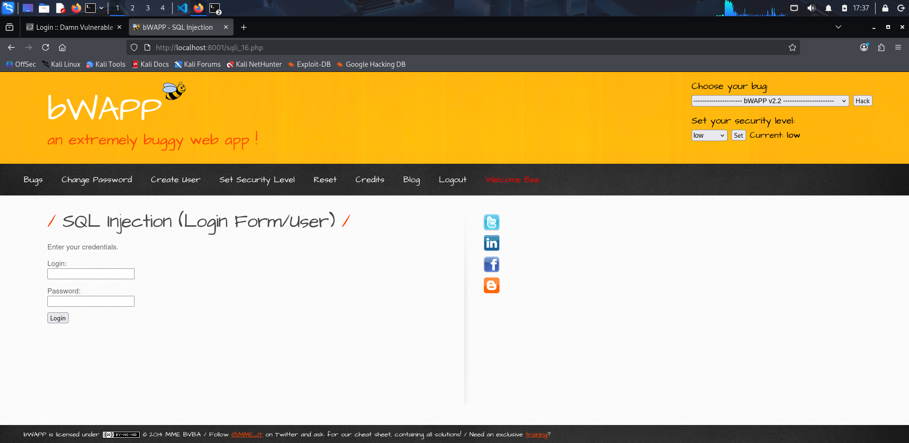
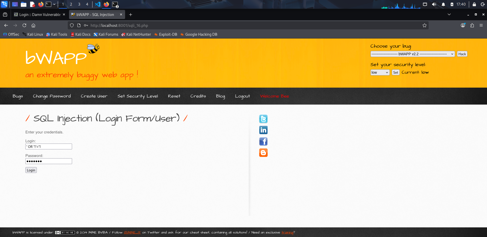
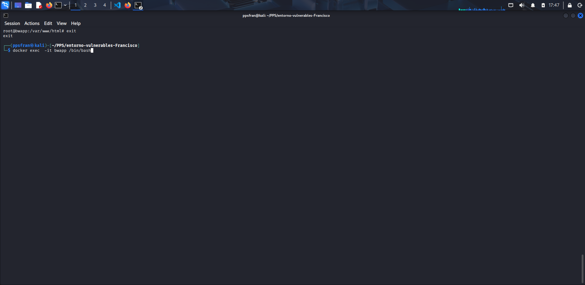
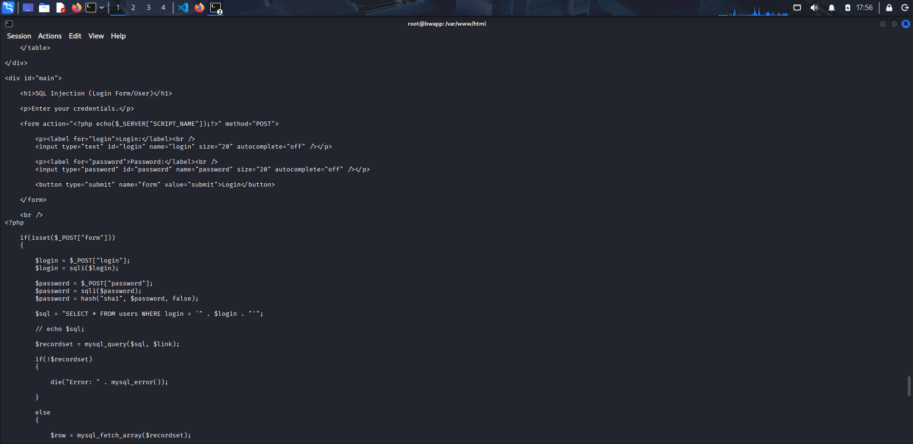
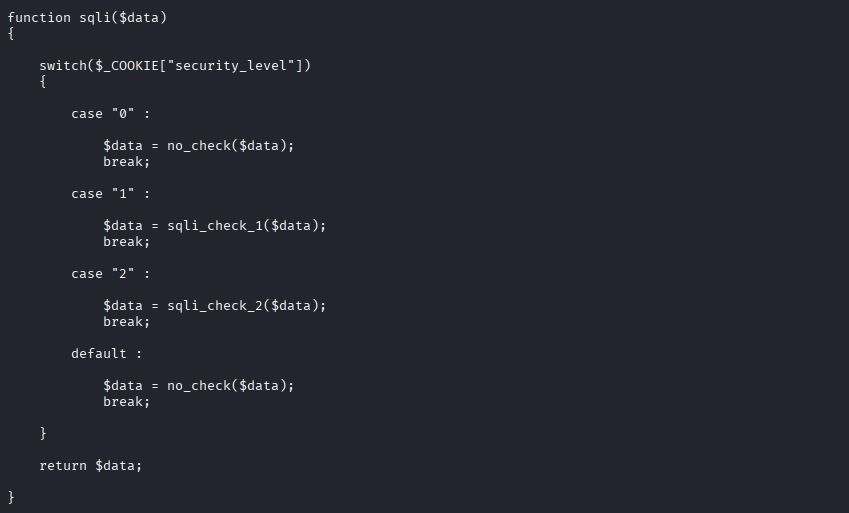
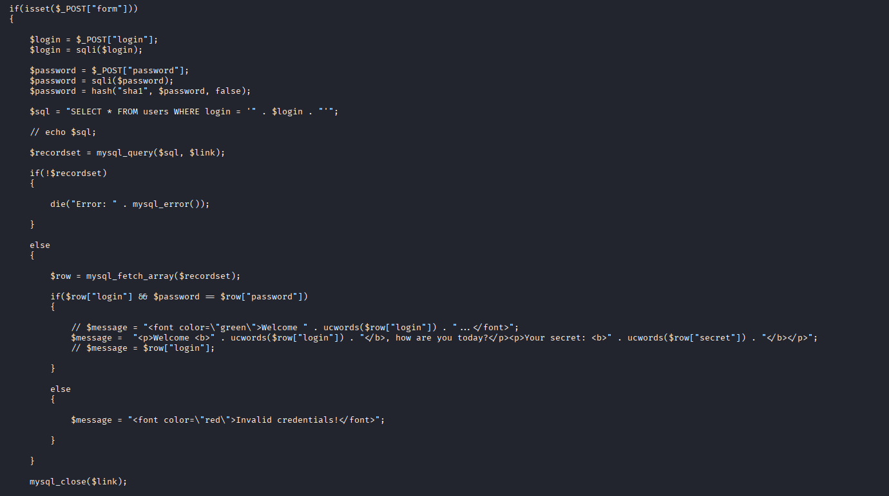

# Análisis de Vulnerabilidad – SQL Injection en bWAPP

## 1. Vulnerabilidad analizada

La vulnerabilidad analizada en esta práctica es:

- **Tipo:** SQL Injection
- **Módulo:** Login Form (User)
- **Método:** POST
- **Impacto:** Acceso no autorizado a la aplicación

Este tipo de vulnerabilidad permite modificar la consulta SQL que se ejecuta en el servidor mediante la introducción de datos maliciosos en los campos de un formulario.


---

## 2. Explotación de la vulnerabilidad

Se accede al módulo vulnerable y se introducen los siguientes valores en el formulario de login:

- **Usuario:**
```sql
' OR '1'='1
```
- **Contraseña:** La que queramos poner 



## 3.Identificación del archivo PHP vulnerable
- Para analizar el funcionamiento interno de la aplicación, se accede al contenedor Docker de bWAPP mediante el siguiente comando:
```
docker exec -it bwapp /bin/bash

```


- El archivo PHP correspondiente al formulario de login contiene el siguiente fragmento de código:
En este punto, el valor introducido por el usuario en el campo Login se concatena directamente dentro de la consulta SQL, sin ningún tipo de validación o sanitización adecuada.



## 4. Tratamiento del input por la aplicación

- El valor del campo Login se procesa mediante la función sqli():
```
$login = $_POST["login"];
$login = sqli($login);
```
- La función sqli() aplica diferentes mecanismos de filtrado en función del nivel de seguridad configurado:




- Con el nivel de seguridad configurado en low (0), la función no_check() devuelve el valor introducido por el usuario sin ningún tipo de filtrado.

## 5.Validación de credenciales
- La consulta SQL únicamente verifica el campo login.
- La contraseña se valida posteriormente en el código PHP mediante la comparación de su hash:



- Esto significa que, aunque la inyección SQL permita seleccionar un usuario válido, es necesario proporcionar la contraseña correcta para completar el proceso de autenticación.
