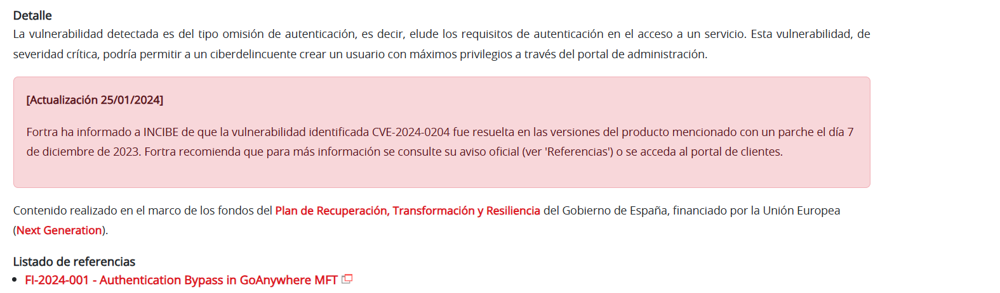
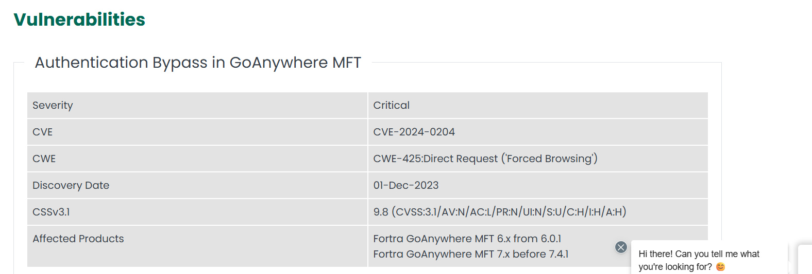
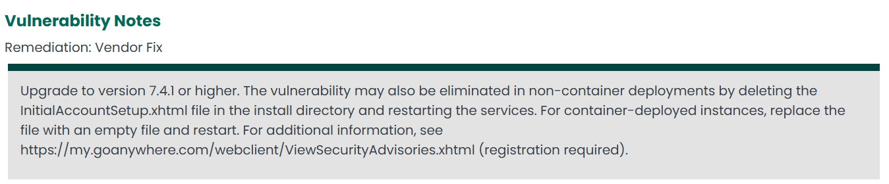
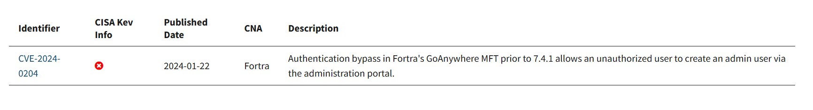
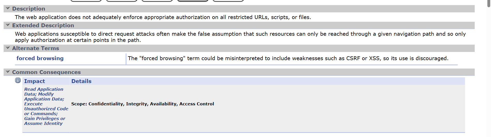
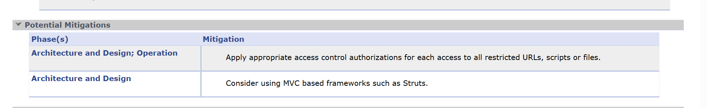
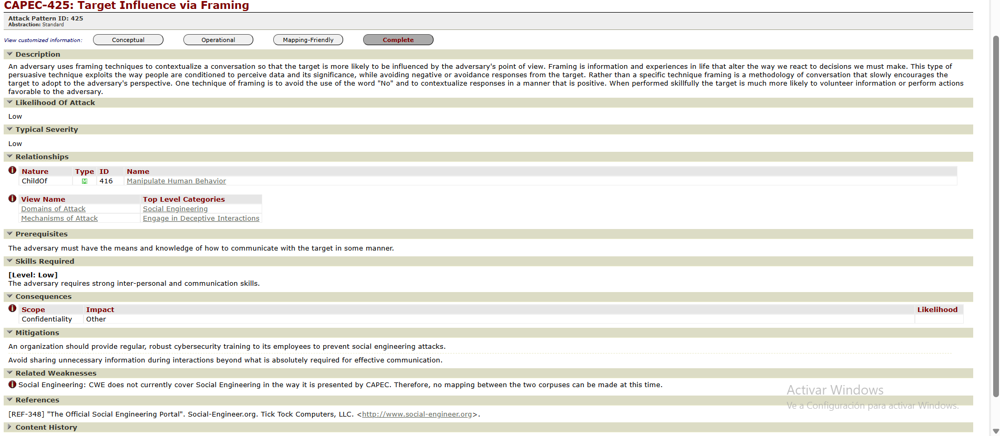

# Trazado de la vulnerabilidad GoAnywhere MFT (CVE-2024-0204)

## Objetivo del documento

En este documento explico el trazado que he hecho de la vulnerabilidad crítica en **GoAnywhere MFT** de Fortra, empezando por el aviso de INCIBE y siguiendo hasta los diferentes listados y referencias (CVE, NVD, CWE, CPE, ATT&CK, etc.).

---

## 1. Punto de partida: aviso de INCIBE

Lo primero que hago es entrar en el aviso de INCIBE llamado  
**“Vulnerabilidad crítica de omisión de autenticación en GoAnywhere MFT de Fortra”**.

En este aviso veo que:

- El producto afectado es **GoAnywhere MFT**, de la empresa **Fortra**.
- El problema es una **omisión de autenticación** en el portal de administración, es decir, se puede saltar el login.
- Un atacante remoto, sin usuario ni contraseña, podría llegar a crear un **usuario administrador** en el sistema.
- Se trata de una vulnerabilidad **crítica**, con una puntuación CVSS muy alta (en torno a 9.8) según las referencias de la CVE.

---

## 2. Aviso del fabricante (Fortra)

Desde el propio aviso de INCIBE voy al apartado de **referencias** y sigo el enlace al aviso oficial de **Fortra** sobre GoAnywhere MFT.

En el aviso del fabricante compruebo varios puntos importantes:

- Se indica claramente el identificador de la vulnerabilidad: **CVE-2024-0204**.
- Se confirma que el fallo permite un **bypass de autenticación** en el portal de administración.
- Se detallan las **versiones vulnerables**, que incluyen versiones de la rama 6.x y 7.x anteriores a la **7.4.1**.
- Se indican las versiones corregidas y se recomienda actualizar a **7.4.1 o superior**.

En el mismo aviso también se comentan medidas de mitigación, por ejemplo:

- Actualizar lo antes posible a una versión corregida.
- Como medida temporal, restringir el acceso al recurso de configuración inicial afectado y reiniciar el servicio.

---

## 3. Consulta del CVE: CVE-2024-0204

Con el identificador **CVE-2024-0204** busco la ficha de la vulnerabilidad en los listados públicos, tanto en **CVE** como en la **NVD (National Vulnerability Database)**.

En la ficha de la CVE veo que:

- Describe la vulnerabilidad como un **authentication bypass** en el portal de administración de GoAnywhere MFT.
- Indica que un atacante no autenticado puede aprovechar un fallo en el proceso de configuración inicial para crear un usuario administrador.

En la ficha de la **NVD** se amplía la información técnica:

- La puntuación **CVSS v3.x** es de **9.8**, clasificada como **crítica**.
- El vector de ataque indica que:
  - El ataque es remoto (por red).
  - La complejidad es baja.
  - No se necesitan privilegios ni interacción del usuario.
  - El impacto en confidencialidad, integridad y disponibilidad es alto.
- También aparecen referencias a la **CWE** relacionada y a los **CPE** que identifican las versiones vulnerables del producto.

---

## 4. Debilidad subyacente: CWE

En la información técnica que consulto se relaciona esta vulnerabilidad con una debilidad del tipo **acceso forzado a recursos**, concretamente **CWE-425: Forced Browsing**.

Cuando reviso la ficha de **CWE-425** en la web de Mitre, se explica que:

- Se trata de una situación en la que un atacante accede a páginas o recursos que deberían estar protegidos, simplemente conociendo o adivinando la URL o la ruta.
- El problema aparece cuando el sistema no comprueba correctamente si el usuario está autenticado o tiene permisos antes de mostrar ese recurso.

Relaciono esta descripción con lo que pasa en GoAnywhere MFT: el atacante consigue llegar al asistente de configuración inicial y, desde ahí, puede crear un usuario administrador aunque el sistema ya esté configurado.

---

## 5. Marcos y patrones de ataque (ATT&CK / CAPEC)

Aunque no siempre se da un **CAPEC** concreto, sí encuentro que esta vulnerabilidad encaja dentro de la táctica de **acceso inicial** del marco **MITRE ATT&CK**, en la técnica:

- **T1190 – Exploit Public-Facing Application**: explotación de una aplicación expuesta a Internet para conseguir acceso inicial.

GoAnywhere MFT suele estar publicado como servicio accesible desde la red, así que explotar **CVE-2024-0204** encaja muy bien con esta técnica, ya que se ataca directamente la interfaz web del producto.

En las fuentes que reviso no siempre se menciona un identificador **CAPEC** concreto para esta vulnerabilidad, así que en el trazado indico que se relaciona con explotación de aplicaciones web expuestas, pero sin un patrón CAPEC específico en las referencias consultadas.

---

